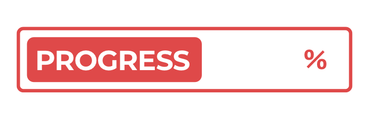

# Bikram Sambat

<div align="center">
  

  <p>A <a href="https://twitter.com/bikram_sambat">tweet bot</a> that tweets progress of the Nepali Calendar a.k.a <a href="https://en.wikipedia.org/wiki/Vikram_Samvat">Bikram Sambat.</a></p>
  <p><em>Inspired from <a href="https://twitter.com/year_progress">@year_progress</a></em></p>
</div>

## Tweet


## Prerequisite

- [GNU Make](https://ftp.gnu.org/old-gnu/Manuals/make-3.79.1/html_chapter/make_1.html)
- [Docker](https://docs.docker.com/install/)

## Usage

Export your [Twitter secrets](https://developer.twitter.com).

```bash
# Twitter Secrets
export TWITTER_CONSUMER_KEY="WEbDazCqR6fVERc8SuD4tK5c"
export TWITTER_CONSUMER_SECRET="BPhmzeZqJ5nfAGGDeEQM8Xrh"
export TWITTER_ACCESS_TOKEN="9gdteNLPQVw5C9vcBfHR8Kkj"
export TWITTER_ACCESS_TOKEN_SECRET="5apcG4rbwSKJvXPtPb2yWk54"
```

And,

```bash
$ make build
$ make run

2019/09/05 16:30:56 Total BS Progress is 39.706226
2019/09/05 16:30:57 Total BS Progress is 39.706230
2019/09/05 16:30:58 Total BS Progress is 39.706234
2019/09/05 16:30:59 Total BS Progress is 39.706238
2019/09/05 16:31:00 Total BS Progress is 39.706238
2019/09/05 16:31:01 Total BS Progress is 39.706245
```

## License

[MIT](LICENSE)
