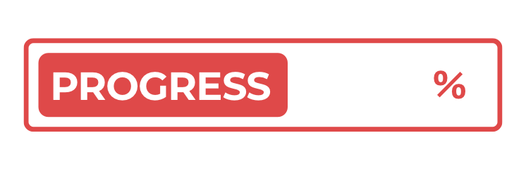

# Bikram Sambat

<div align="center">
  

  <p>A tweet bot that tweets progress of the Nepali Calendar a.k.a <a href="https://en.wikipedia.org/wiki/Vikram_Samvat">Bikram Sambat.</a></p>
</div>

## Prerequisite

- [Docker](https://docs.docker.com/install/)

## Usage

```bash
$ make build
$ make run

2019/09/05 16:30:56 Total BS Progress is 39.706226
2019/09/05 16:30:57 Total BS Progress is 39.706230
2019/09/05 16:30:58 Total BS Progress is 39.706234
2019/09/05 16:30:59 Total BS Progress is 39.706238
2019/09/05 16:31:00 Total BS Progress is 39.706238
2019/09/05 16:31:01 Total BS Progress is 39.706245
```

## License

[MIT](LICENSE)
